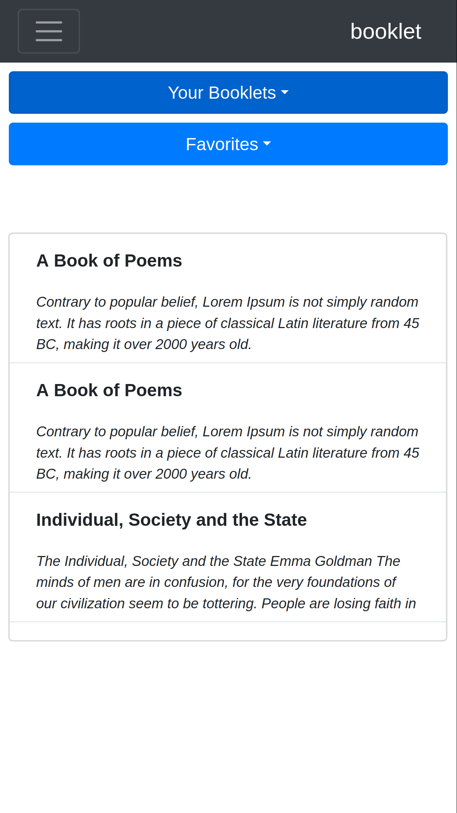
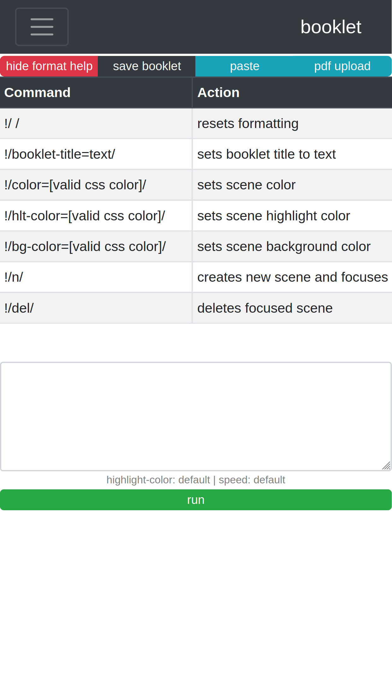
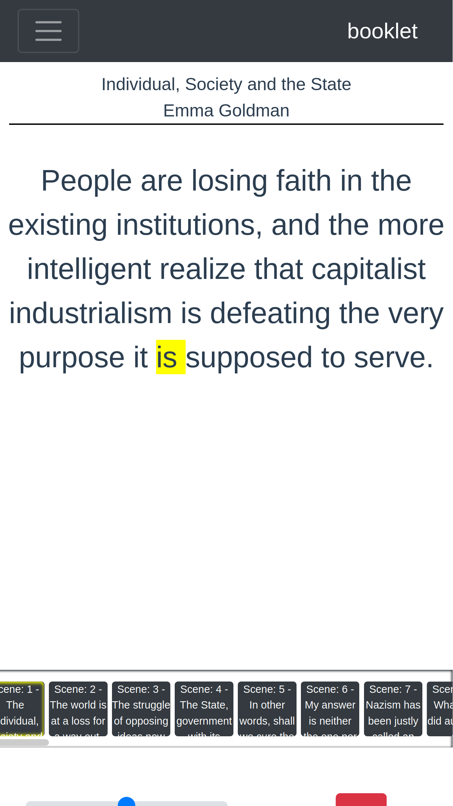

# booklet

Text reader application. 
* Vue.js w/ [Boostrap vue](https://bootstrap-vue.org/) to make things look pretty.
* [Express server](https://expressjs.com/) on the backend.
* [passport.js](http://www.passportjs.org/docs/) for user authentication. 
* [Mongodb](https://docs.mongodb.com/guides/), [mongoose](https://mongoosejs.com/), [passport-local-mongoose](https://www.npmjs.com/package/passport-local-mongoose) for data storage/manipulation. 
* [pdf-parse](https://www.npmjs.com/package/pdf-parse) for parsing pdfs

Read text in easily digested snippets. No tapping for next page. Press play and let the content capture your attention. 

Here's some screen shots with current progress.

## User View


## Create Booklet


## Booklet Viewer


## Project setup
In three terminals

1. Make sure you have mongodb installed and then
```
cd backend
mongod -dbpath=data
```
2. Get the express server running
```
cd backend
npm install
node app.js
```
3. Get vue.js frontend up and running
```
cd frontend 
npm install
npm run serve
```
