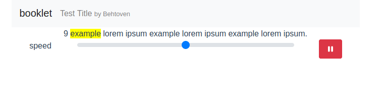

# booklet

Text reader application using Vue.js. Read text in easily digested snippets. No tapping for next page. Press play and let the content capture your attention. 

## in progress screen


## Project setup
In two terminals

1. 
```
cd backend
npm install
node app.js
```
2. 
```
cd frontend 
npm install
npm run serve
```
